# Project: Smart Plant Monitoring System with ESP32

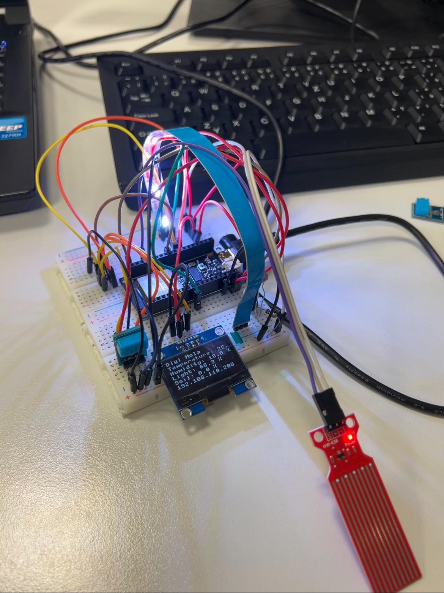
<br>
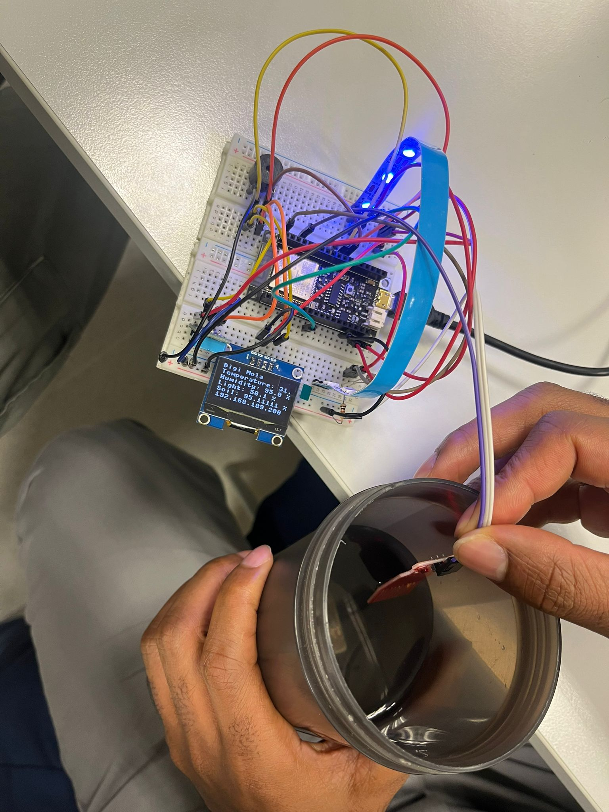
<br>
 <a href="https://drive.google.com/file/d/1jHefg1LyvdDhoFzPaILHQ8uCBUfU4nUQ/view?usp=drive_link">Video demonstration:</a> 
 <br>
 <a href="https://drive.google.com/file/d/1NfFNMBMDXJLzqxy-OR9mIS4ixqfroVZn/view?usp=drive_link">Video demonstration lights:</a> 
 <br>
 
## Quick try it out
1. **Clone this repository:**
   ```bash
   git clone https://github.com/MarioLOI/Digital-Electronics-Project

   Make sure you have ESP and Thonny or any micropython IDE configured and you have Python installed. 
   Upload files in esp_memory to micropython device(ESP32).
   Control requirements.txt for missing packages and refer to the project at the end of this file to get started. 
<br>
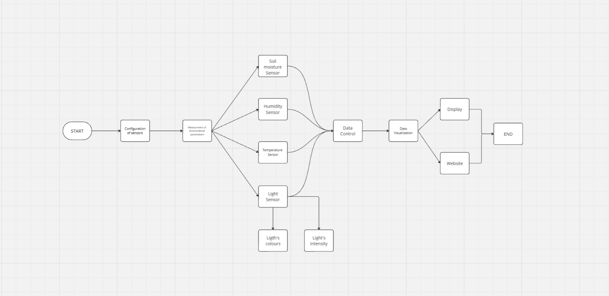
<br>

## A note about this repository
Measurement/Control/Visualization of the environment for tropical plants :
The goal of the project would be to create a system that measures key environmental parameters (such as temperature, humidity, light levels, soil moisture) for tropical plants.
This system should also allow the user to control or adjust environmental conditions and visualize the data.

This project was developed by Gerson Hauwanga, Adrián Macias and Mario Loizaga. The aim is to create a smart environmental monitoring system using an ESP32, sensors for temperature, humidity, light, and soil moisture, along with an integrated web server for real-time data visualization.

The system measures and displays sensor values on an OLED screen and transmits this data through a web interface. It also includes LED control based on detected light levels and a buzzer alert for critical soil moisture conditions.

We have developed the project using Thonny, a programming environment that allows us to interact directly with microdevices like the ESP32.
By programming in MicroPython, we can create, delete, modify, automate, control, and improve device functions to build a final project that meets our exact requirements.
To achieve this, it is essential to have a solid understanding of MicroPython and the ability to write efficient code that aligns with our objectives.
Additionally, a foundational knowledge of timers, displays, and synchronous/asynchronous communication is beneficial for comprehending the operation of microcontrollers and sensors.
Subsequently, we will create or utilize the files outlined later and upload them to the ESP32 to enable the use of these modules when executed from the main program.

## Main Features
#### I2C communication:
I2C, which stands for Inter-Integrated Circuit, is a simple, low-speed serial communication protocol commonly used for short-distance communication between integrated circuits on a single printed circuit board.
It's particularly popular in embedded systems due to its simplicity and low cost.
I2C (Inter-Integrated Circuit, I2C, IIC, [eye-squared-C]) is two-wire, synchronous,bi-directional, half-duplex, short-distance, intra-board, serial bus communication
SCL (one-directional Serial Clock), SDA (bi-directional Serial Data) signals
One Master, one or more Slave devices
Communication protocol consists of: Start condition, Address frame, Data frame, Stop condition.

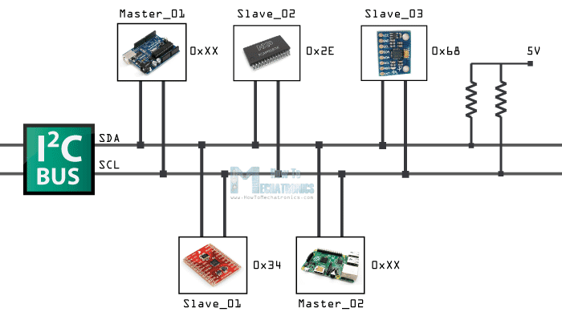
 

#### Photoresistor:
A photoresistor, also known as a Light-Dependent Resistor (LDR) or photoconductor, is an electronic component whose electrical resistance varies depending on the amount of light that falls on it.
In simpler terms, the more light it receives, the lower its resistance becomes.
- How does it work?
When light hits the semiconductor material of a photoresistor, photons (particles of light) provide energy to electrons, allowing them to move more freely. 
This increased movement of electrons reduces the overall resistance of the material.

#### Humidity and Temperature:
- Temperature Sensor: Typically uses a thermistor or a semiconductor to measure temperature changes. A thermistor changes its resistance with temperature, while a semiconductor uses voltage variations.
The sensor detects temperature changes by measuring resistance or voltage. The signal is processed by a microcontroller to give a readable temperature output.
- Humidity Sensor: Often uses a capacitive or resistive element. In capacitive sensors, the dielectric constant changes based on moisture in the air, altering capacitance. In resistive sensors, electrical resistance changes with humidity.
The sensor detects moisture levels by measuring changes in capacitance or resistance. The more moisture in the air, the higher the dielectric constant or the lower the resistance, and vice versa.

#### Soil moisture:
Soil moisture refers to the amount of water present in the soil. It's a critical factor for life on Earth, influencing:
- Plant growth: Water is essential for plants to absorb nutrients and perform photosynthesis.
- Biogeochemical cycles: Soil moisture plays a crucial role in the water, carbon, and other element cycles.
- Soil stability: Moisture affects soil structure and its ability to resist erosion.
- Climate: Evaporation of water from the soil influences atmospheric humidity and precipitation.

#### Display:
LCD (Liquid Crystal Display) is an electronic device which is used for display any ASCII text. There are many different screen sizes e.g. 16x1, 16x2, 16x4, 20x4, 40x4 characters and each character is made of 5x8 matrix pixel dots.
LCD displays have different LED back-light in yellow-green, white and blue color. LCD modules are mostly available in COB (Chip-On-Board) type.
With this method, the controller IC chip or driver (here: HD44780) is directly mounted on the backside of the LCD module itself.

### Web page:
A threading library provides a way to manage multiple threads of execution within a single process.
In the context of web development, threading allows you to handle multiple tasks concurrently, improving the responsiveness of your application.
Then we developed a web page for showing data after reading it. We did it focused on the purpose of controlling data faster and automatically.
Also we can see if any value is lower or higher immediatly and react to that.

#### Case of SEMIDRY soil:
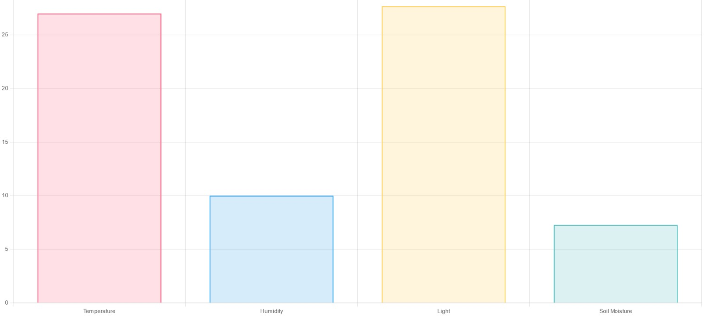

#### Case of DRY soil:
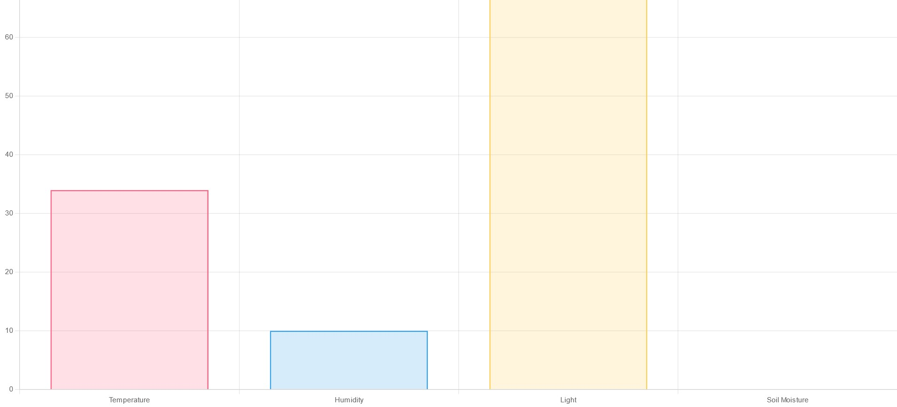

#### Case of FLOODED soil:
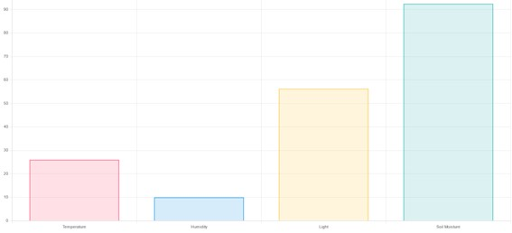

### External Modules
- **`threading`**: Allows parallel runtime for server application
- **`neopixel`**: Controls the NeoPixel LEDs.
- **`machine`**: Interacts with ESP32 hardware.
- **`socket`**: Powers the web server.
- **`time`**: Manipulates the time
- **`sh1106`**: Shows text and images, Creates user interfaces and Draw graphics.                                           
                                
### Microdevices and Sensors

1. **ESP32**  
   - Acts as the main microcontroller.
   - Connects sensors and manages the web server.

   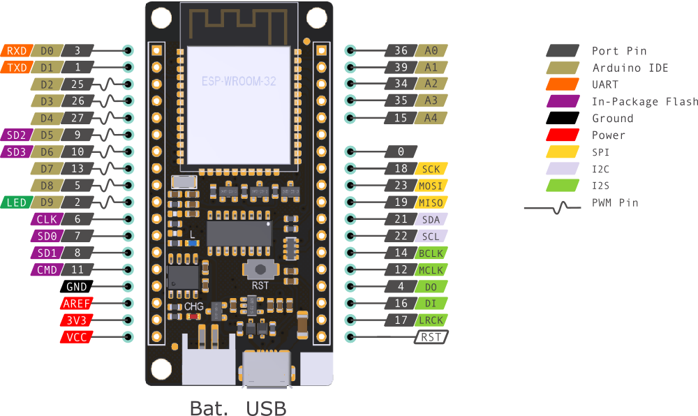

2. **OLED Display (SH1106)**  
   - Displays real-time information.  
   - Connected via I2C (GPIO 21 and GPIO 22).
   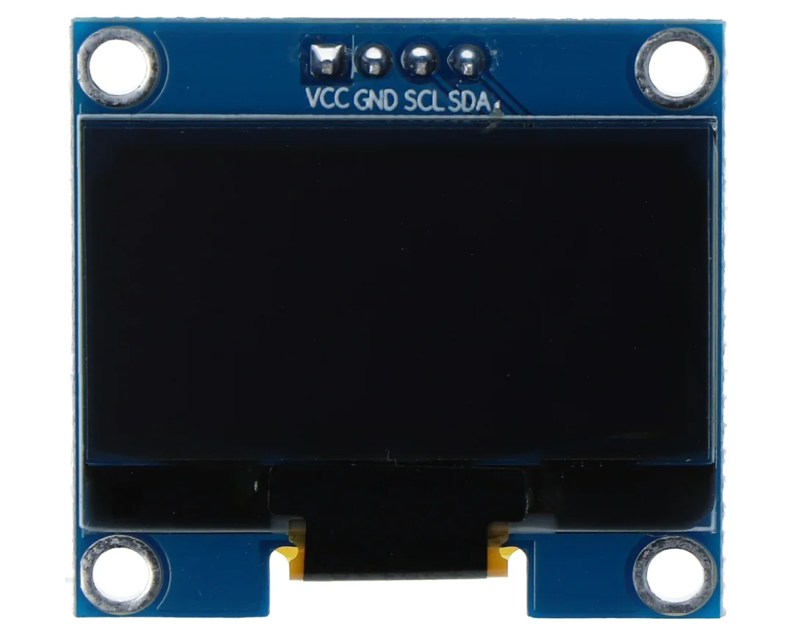


3. **Soil Moisture Sensor**
   - Detects soil moisture levels.
   - Model: TD-SEN18 (need 3v3 power supply)
   - Connected to ESP32 ADC (GPIO 35).
   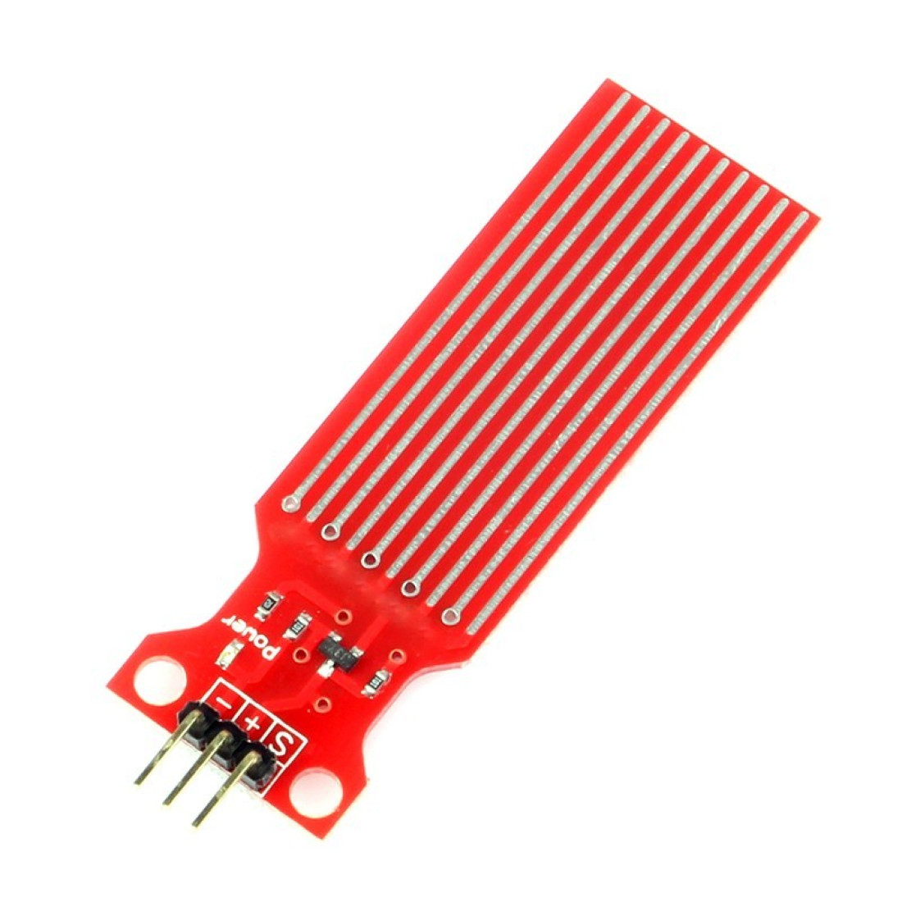

4. **Humidity and Temperature Sensor**
   - Dual Measurement Capability: Measures both temperature and humidity simultaneously.
   - Model: DHT12
   - Digital Output: Provides easy integration with microcontrollers via protocols like I2C.
   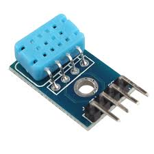

6. **Photoresistor**  
   - Measures ambient light.  
   - Connected to analog pin 36.
   - Important connection note: It must be connected in series with a 10kΩ resistor (we need a voltage divider), with one of its leads going to ground. We will connect the 3.3V power supply to the free lead of the photoresistor, and the lead connected in series with the resistor will be connected to pin 36.
   

7. **NeoPixel LEDs**  
   - Controlled from GPIO 5.
   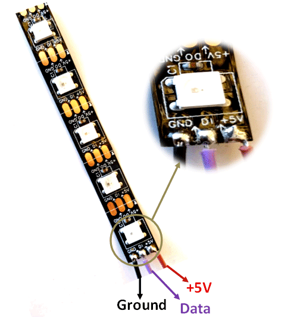

8. **Buzzer**  
   - Controlled from GPIO 23.
   

### Connections
   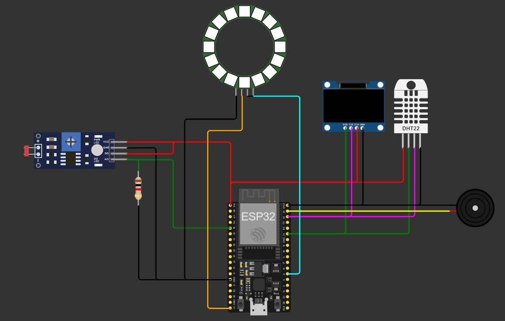

| Component              | ESP32 Pin                    |
|------------------------|------------------------------|
| OLED Display (I2C)     | GPIO 21 (SDA), GPIO 22 (SCL) |
| Photoresistor          | GPIO 36                      |
| Soil Moisture Sensor   | GPIO 35                      |
| NeoPixel LEDs          | GPIO 5                       |
| Buzzer                 | GPIO 23                      |

### Video

                                               
### Installation and Usage

1. **Clone this repository:**
   ```bash
   git clone https://github.com/MarioLOI/Digital-Electronics-Project

Make sure you have ESP and Thonny or any micropython IDE configured and you have Python installed. 
Upload files in esp_memory to micropython device memory with save as -> micropython device.
Control requirements.txt for missing packages and install them using Thonny package manager under "Tool"
Set up your wifi password to file server.py
Then start.

### Authors:
- Gerson Hauwanga https://github.com/ghauwanga
- Adrián Macias https://github.com/macias04
- Mario Loizaga https://github.com/MarioLOI

### References:
- [Soil Moisture](https://github.com/tomas-fryza/esp-micropython/blob/main/examples/13-adc/main.py)
- [I2C operations](https://docs.micropython.org/en/v1.13/library/machine.I2C.html)
- [Photoresistor](https://esp32io.com/tutorials/esp32-light-sensor)
- [sh1106 module](https://github.com/tomas-fryza/esp-micropython/tree/main/modules)
- [Strip LEDS](https://randomnerdtutorials.com/micropython-ws2812b-addressable-rgb-leds-neopixel-esp32-esp8266/)
- [Buzzer](https://wokwi.com/projects/397532117199559681)
